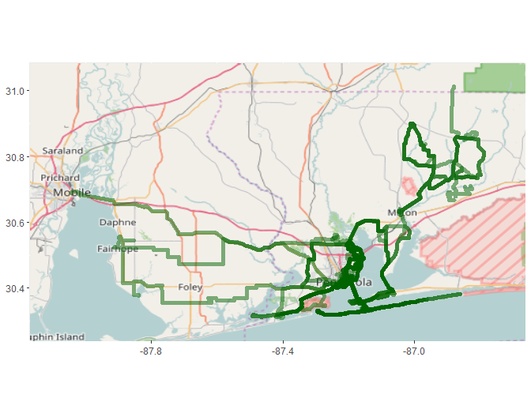
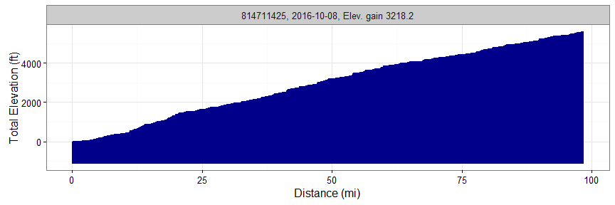

# rStrava

##### *Marcus W. Beck, mbafs2012@gmail.com, Pedro Villarroel, pedrodvf@gmail.com, Daniel Padfield, dp323@exeter.ac.uk*

Linux: [](https://travis-ci.org/fawda123/rStrava)

Windows: [](https://ci.appveyor.com/project/fawda123/rStrava)


### Overview and installation

This is the development repository for rStrava, an R package to access data from the Strava API.  The package can be installed and loaded as follows:


```r
install.packages('devtools')
devtools::install_github('fawda123/rStrava')
```

### Issues and suggestions

Please report any issues and suggestions on the [issues link](https://github.com/fawda123/rStrava/issues) for the repository.

### Package overview

The functions are in three categories depending on mode of use.  The first category of functions scrape data from the public Strava website and the second category uses the API functions or relies on data from the API functions.  The second category requires an authentication token.  The help files for each category can be viewed using ```help.search```:


```r
help.search('notoken', package = 'rStrava')
help.search('token', package = 'rStrava')
```

#### Scraping functions (no token)

An example using the scraping functions:


```r
# get athlete data for these guys
athl_fun(c(2837007, 2527465, 2140248), trace = FALSE)
```

```
## $`2837007`
## $`2837007`$units
## [1] "mi" "h"  "m"  "ft"
## 
## $`2837007`$location
## [1] "Pensacola, FL"
## 
## $`2837007`$current_month
##   Distance       Time  Elevation 
##  177.80000   11.43333 3567.00000 
## 
## $`2837007`$monthly
## Oct 2015      Nov      Dec Jan 2016      Feb      Mar      Apr      May 
##  696.976  433.832  405.384  448.056  348.488  469.392  469.392  369.824 
##      Jun      Jul      Aug      Sep      Oct 
##  469.392  476.504  327.152  455.168  177.800 
## 
## $`2837007`$year_to_date
##       Distance           Time Elevation Gain          Rides 
##      3782.4000       236.8167     23323.0000       284.0000 
## 
## $`2837007`$all_time
##  Total Distance      Total Time Total Elev Gain     Total Rides 
##         16542.4           984.6        107858.0          1202.0 
## 
## 
## $`2527465`
## $`2527465`$units
## [1] "km" "h"  "m"  "m" 
## 
## $`2527465`$location
## [1] "Caracas, Distrito Metropolitano de Caracas, Venezuela"
## 
## $`2527465`$current_month
##  Distance      Time Elevation 
## 15.700000  1.466667 46.000000 
## 
## $`2527465`$monthly
## Oct 2015      Nov      Dec Jan 2016      Feb      Mar      Apr      May 
##    282.6    251.2    361.1     31.4    172.7    376.8    376.8    612.3 
##      Jun      Jul      Aug      Sep      Oct 
##    329.7    392.5   1522.9    376.8     15.7 
## 
## $`2527465`$year_to_date
##       Distance           Time Elevation Gain          Rides 
##      4568.9000       245.9833     43039.0000       111.0000 
## 
## $`2527465`$all_time
##  Total Distance      Total Time Total Elev Gain     Total Rides 
##      12432.8000        679.4333     162701.0000        447.0000 
## 
## 
## $`2140248`
## $`2140248`$units
## [1] "km" "h"  "m"  "m" 
## 
## $`2140248`$location
## [1] "Falmouth, England, United Kingdom"
## 
## $`2140248`$current_month
##  Distance      Time Elevation 
##    254.00     11.25   3107.00 
## 
## $`2140248`$monthly
##   Oct 2015        Nov        Dec   Jan 2016        Feb        Mar 
## 538.238095  66.523810   0.000000 139.095238   6.047619  78.619048 
##        Apr        May        Jun        Jul        Aug        Sep 
## 399.142857 241.904762 308.428571 562.428571 320.523810  54.428571 
##        Oct 
## 254.000000 
## 
## $`2140248`$year_to_date
##       Distance           Time Elevation Gain          Rides 
##     2298.80000       96.38333    27161.00000       76.00000 
## 
## $`2140248`$all_time
##  Total Distance      Total Time Total Elev Gain     Total Rides 
##       6837.6000        290.2833      83491.0000        477.0000
```

#### API functions (token)

These functions require a Strava account and a personal API, both of which can be obtained on the Strava website.  The user account can be created by following instructions on the [Strava homepage](https://www.strava.com/).  After the account is created, a personal API can be created under API tab of [profile settings](https://www.strava.com/settings/api).  The user must have an application name (chosen by the user), client id (different from the athlete id), and an application secret to create the authentication token.  Additional information about the personal API can be found [here](https://strava.github.io/api/).  Every API retrieval function in the rStrava package requires an authentication token (called `stoken` in the help documents).  The following is a suggested workflow for using the API functions with rStrava.

First, create the authentication token using your personal information from your API.  Replace the `app_name`, `app_client_id`, and `app_secret` objects with the relevant info from your account.

```r
app_name <- 'myappname' # chosen by user
app_client_id  <- 'myid' # an integer, assigned by Strava
app_secret <- 'xxxxxxxx' # an alphanumeric secret, assigned by Strava

# create the authentication token
stoken <- httr::config(token = strava_oauth(app_name, app_client_id, app_secret))
```

The API retrieval functions can be used after the token is created.


```r
myinfo <- get_athlete(stoken, id = '2837007')
head(myinfo)
```

```
## $id
## [1] 2837007
## 
## $username
## [1] "beck_marcus"
## 
## $resource_state
## [1] 3
## 
## $firstname
## [1] "Marcus"
## 
## $lastname
## [1] "Beck"
## 
## $city
## [1] "Pensacola"
```

An example creating a heat map of activities:

```r
# get activities, get activities by location, plot
my_acts <- get_activity_list(stoken)
acts <- lapply(my_acts, function(x) x$location_city) %in% c('Pensacola', 'Pensacola Beach', 'Milton') 
get_heat_map(my_acts, acts = which(acts), source = 'osm', col = 'darkgreen', size = 2)
```

<!-- -->

Plotting elevation and grade for a single ride:

```r
# plot elevation along a single ride
get_heat_map(my_acts, acts = 1, alpha = 1, add_elev = T, f = 0.1, key = mykey, size = 2, col = 'Spectral', maptype = 'satellite', units = 'imperial')
```

<!-- -->

```r
# plot % gradient along a single ride
get_heat_map(my_acts, acts = 1, alpha = 1, add_elev = T, f = 0.1, as_grad = T, key = mykey, size = 2, col = 'Spectral', expand = 5, maptype = 'satellite', units = 'imperial')
```

<!-- -->

Get elevation profiles for activities:

```r
# get activities
my_acts <- get_activity_list(stoken) 

get_elev_prof(my_acts, acts = 1, key = mykey, units = 'imperial')
```

<!-- -->

```r
get_elev_prof(my_acts, acts = 1, key = mykey, units = 'imperial', total = T)
```

<!-- -->

### License

This package is released in the public domain under the creative commons license [CC0](https://tldrlegal.com/license/creative-commons-cc0-1.0-universal). 
