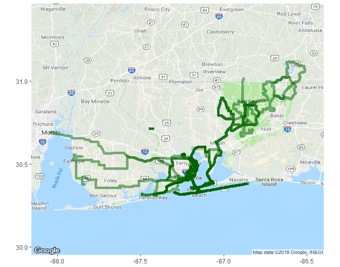
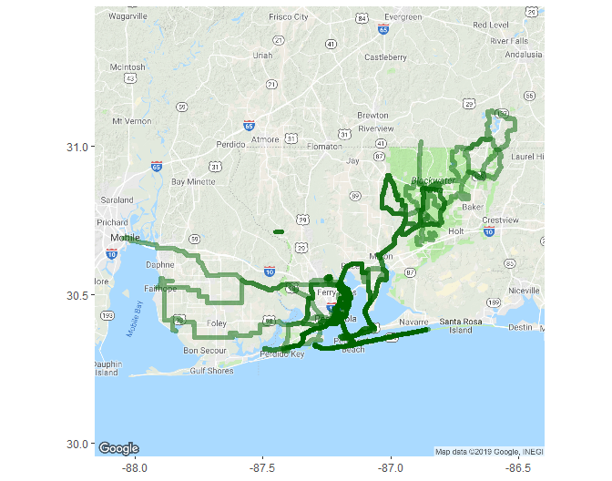
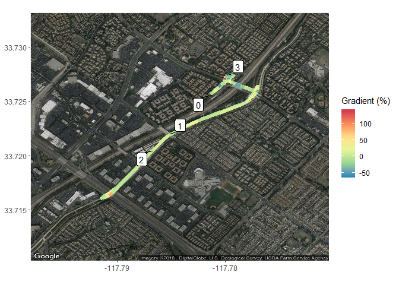
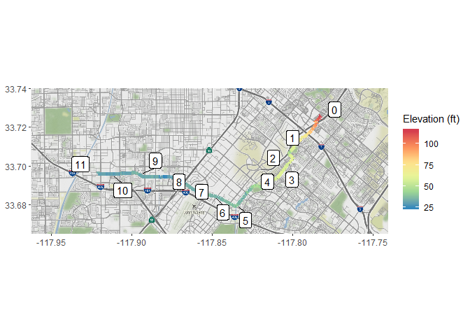
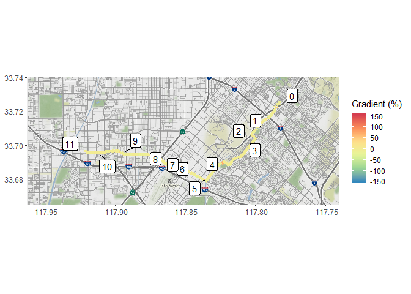

# rStrava

##### *Marcus W. Beck, mbafs2012@gmail.com, Pedro Villarroel, pedrodvf@gmail.com, Daniel Padfield, dp323@exeter.ac.uk*

Linux: [](https://travis-ci.org/fawda123/rStrava)

Windows: [](https://ci.appveyor.com/project/fawda123/rStrava)

[](https://zenodo.org/badge/latestdoi/22622714)


### Overview and installation

This is the development repository for rStrava, an R package to access data from the Strava API.  The package can be installed and loaded as follows:


```r
install.packages('devtools')
devtools::install_github('fawda123/rStrava')
```

### Issues and suggestions

Please report any issues and suggestions on the [issues link](https://github.com/fawda123/rStrava/issues) for the repository.

### Package overview

The functions are in two categories depending on mode of use.  The first category of functions scrape data from the public Strava website and the second category uses the API functions or relies on data from the API functions.  The second category requires an authentication token.  The help files for each category can be viewed using ```help.search```:


```r
help.search('notoken', package = 'rStrava')
help.search('token', package = 'rStrava')
```

### Scraping functions (no token)

An example using the scraping functions:


```r
# get athlete data for these guys
athl_fun(c(2837007, 2527465, 2140248), trace = FALSE)
```

```
## $`2837007`
## $`2837007`$units
## [1] "mi" "h"  "m"  "ft"
## 
## $`2837007`$location
## [1] "Pensacola, FL"
## 
## $`2837007`$current_month
##  Distance      Time Elevation 
##    153.70      9.85   2135.00 
## 
## $`2837007`$monthly
## Jun 2016      Jul      Aug      Sep      Oct      Nov      Dec Jan 2017 
## 456.1419 461.1000 322.2742 446.2258 436.3097 322.2742 391.6871 366.8968 
##      Feb      Mar      Apr      May      Jun 
## 218.1548 371.8548 371.8548 252.8613 153.7000 
## 
## $`2837007`$year_to_date
##       Distance           Time Elevation Gain          Rides 
##      1591.9000       103.1667     13510.0000       138.0000 
## 
## $`2837007`$all_time
##  Total Distance      Total Time Total Elev Gain     Total Rides 
##        19066.90         1151.45       126217.00         1423.00 
## 
## 
## $`2527465`
## $`2527465`$units
## [1] "km" "h"  "m"  "m" 
## 
## $`2527465`$location
## [1] "Buenos Aires, Ciudad Autónoma de Buenos Aires, Argentina"
## 
## $`2527465`$current_month
##   Distance       Time  Elevation 
##  190.10000   12.46667 1014.00000 
## 
## $`2527465`$monthly
##  Jun 2016       Jul       Aug       Sep       Oct       Nov       Dec 
##  362.9182  432.0455 1676.3364  414.7636  328.3545  553.0182 1036.9091 
##  Jan 2017       Feb       Mar       Apr       May       Jun 
##  570.3000  414.7636  449.3273  190.1000    0.0000    0.0000 
## 
## $`2527465`$year_to_date
##       Distance           Time Elevation Gain          Rides 
##        1607.10          81.55        7485.00          51.00 
## 
## $`2527465`$all_time
##  Total Distance      Total Time Total Elev Gain     Total Rides 
##         15917.6           870.7        178441.0           555.0 
## 
## 
## $`2140248`
## $`2140248`$units
## [1] "km" "h"  "m"  "m" 
## 
## $`2140248`$location
## [1] "Falmouth, England, United Kingdom"
## 
## $`2140248`$current_month
##    Distance        Time   Elevation 
##   80.800000    5.183333 1442.000000 
## 
## $`2140248`$monthly
##  Jun 2016       Jul       Aug       Sep       Oct       Nov       Dec 
## 316.98462 578.03077 329.41538  55.93846 385.35385   0.00000   0.00000 
##  Jan 2017       Feb       Mar       Apr       May       Jun 
## 279.69231  87.01538  74.58462 310.76923 292.12308  80.80000 
## 
## $`2140248`$year_to_date
##       Distance           Time Elevation Gain          Rides 
##      881.30000       37.63333    11262.00000       27.00000 
## 
## $`2140248`$all_time
##  Total Distance      Total Time Total Elev Gain     Total Rides 
##       7837.1000        332.4167      96105.0000        507.0000
```

### API functions (token)

#### Setup 

These functions require a Strava account and a personal API, both of which can be obtained on the Strava website.  The user account can be created by following instructions on the [Strava homepage](https://www.strava.com/).  After the account is created, a personal API can be created under API tab of [profile settings](https://www.strava.com/settings/api).  The user must have an application name (chosen by the user), client id (different from the athlete id), and an application secret to create the authentication token.  Additional information about the personal API can be found [here](https://strava.github.io/api/).  Every API retrieval function in the rStrava package requires an authentication token (called `stoken` in the help documents).  The following is a suggested workflow for using the API functions with rStrava.

First, create the authentication token using your personal information from your API.  Replace the `app_name`, `app_client_id`, and `app_secret` objects with the relevant info from your account.

```r
app_name <- 'myappname' # chosen by user
app_client_id  <- 'myid' # an integer, assigned by Strava
app_secret <- 'xxxxxxxx' # an alphanumeric secret, assigned by Strava

# create the authentication token
stoken <- httr::config(token = strava_oauth(app_name, app_client_id, app_secret))
```

Setting `cache = TRUE` for `strava_oauth` will create an authentication file in the working directory. This can be used in later sessions as follows:

```r
stoken <- httr::config(token = readRDS('.httr-oauth')[[1]])
```

Finally, the `get_heat_map` and `get_elev_prof` functions optionally retrieve elevation data from the Google Maps Elevation API. To use these features, an additional authentication key is required.  Follow the instructions [here](https://developers.google.com/maps/documentation/elevation/#api_key).  The key can be added to the R environment file for later use:


```r
# save the key, do only once
cat("google_key=XXXXXXXXXXXXXXXXXXXXXXXXXXXXXXXXXXXXXX\n",
    file=file.path(normalizePath("~/"), ".Renviron"),
    append=TRUE)

# retrieve the key, restart R if not found
mykey <- Sys.getenv("google_key")
```

#### Using the functions

The API retrieval functions are used with the token.


```r
myinfo <- get_athlete(stoken, id = '2837007')
head(myinfo)
```

```
## $id
## [1] 2837007
## 
## $username
## [1] "beck_marcus"
## 
## $resource_state
## [1] 3
## 
## $firstname
## [1] "Marcus"
## 
## $lastname
## [1] "Beck"
## 
## $city
## [1] "Pensacola"
```

An example creating a heat map of activities:

```r
# get activities, get activities by location, plot
my_acts <- get_activity_list(stoken)
acts <- lapply(my_acts, function(x) x$location_city) %in% c('Pensacola', 'Pensacola Beach', 'Milton') 
get_heat_map(my_acts, acts = which(acts), col = 'darkgreen', size = 2, dist = F)
```

<!-- -->

Plotting elevation and grade for a single ride:

```r
# plot elevation along a single ride
get_heat_map(my_acts, acts = 1, alpha = 1, add_elev = T, f = 0.1, key = mykey, size = 2, col = 'Spectral', maptype = 'satellite', units = 'imperial')
```

<!-- -->

```r
# plot % gradient along a single ride
get_heat_map(my_acts, acts = 1, alpha = 1, add_elev = T, f = 0.1, as_grad = T, key = mykey, size = 2, col = 'Spectral', expand = 5, maptype = 'satellite', units = 'imperial')
```

<!-- -->

Get elevation profiles for activities:

```r
# get activities
my_acts <- get_activity_list(stoken) 

get_elev_prof(my_acts, acts = 1, key = mykey, units = 'imperial')
```

<!-- -->

```r
get_elev_prof(my_acts, acts = 1, key = mykey, units = 'imperial', total = T)
```

<!-- -->

Plot average speed per split (km or mile) for an activity:

```r
# plots for most recent activity
get_spdsplits(my_acts, stoken, acts = 1)
```

<!-- -->

### License

This package is released in the public domain under the creative commons license [CC0](https://tldrlegal.com/license/creative-commons-cc0-1.0-universal). 
